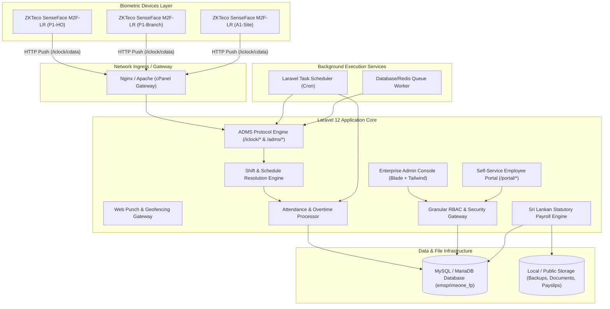

# Attendance & Workforce Management System (AMS)
## Document 01: Project Handover Document

| Document Metadata | Details |
| :--- | :--- |
| **System Name** | Attendance Management System (AMS) - Biometric, Workforce & Payroll Platform |
| **Current Version** | V2.4 (Enterprise Edition) |
| **Framework & Engine** | Laravel 12.x / PHP 8.2+ / MySQL 8.0 or MariaDB 10.4+ |
| **Integrated Hardware** | ZKTeco SenseFace M2F-LR & ZKTeco Push/ADMS Biometric Devices |
| **Target Organizations** | Prime One Global (P1), Altitude 1 (A1), and affiliated multi-company tenants |
| **Primary Repository** | `c:\xampp\htdocs\laravel-project-Bio-metrics` (`abarna1997/laravel-project-Bio-metrics`) |
| **Date of Handover** | September 2026 |
| **Document Classification** | Confidential / Enterprise Internal |

---

## 1. Executive Summary & Handover Purpose

This **Project Handover Document** provides an authoritative transition guide for incoming engineering leadership, software developers, DevOps engineers, and system administrators assuming stewardship of the **Attendance Management System (AMS)**.

AMS is a centralized enterprise platform engineered to unify:
1. Multi-branch physical biometric timekeeping with push-protocol hardware (ZKTeco SenseFace M2F-LR).
2. End-to-end employee lifecycle governance (digital onboarding, document management, asset allocation, transfers, and separations).
3. Complex workforce scheduling with overnight, split, and rotating shifts.
4. Sri Lankan statutory payroll computation complying with EPF, ETF, and Inland Revenue Department (IRD) APIT tax regulations.
5. Enterprise governance with granular RBAC, access level scoping, immutable audit logging, and Single Sign-On (SSO) integrations.

This document establishes the operational ownership, codebase layout, infrastructure dependencies, operational procedures, known technical nuances, and sign-off criteria required for a seamless transition.

---

## 2. Key Stakeholders & Contact Matrix

| Role | Responsibility | Contact Domain |
| :--- | :--- | :--- |
| **Product Owner** | Functional feature roadmap, compliance approvals, and business sign-off | Human Resources & Operations |
| **Lead Software Architect** | Platform architecture, ADMS protocol engine, and statutory payroll algorithms | Core Engineering Team |
| **DevOps / SysAdmin** | Server infrastructure, cPanel/VPS maintenance, SSL, cron jobs, and backups | IT Infrastructure & Security |
| **Biometric Hardware Specialist** | Physical terminal deployment, network IP configuration, and field enrollment | Field Operations / IT Support |
| **Compliance Officer** | Sri Lankan Labour Department regulations, EPF/ETF statutory filings, APIT verification | Finance & Payroll |

---

## 3. System Architecture & High-Level Topology



---

## 4. Complete Module Inventory & Functional Scope

### 4.1 Organization & Multi-Company Hierarchy
- **Multi-Tenant Segregation**: Built-in multi-company isolation supporting distinct enterprise entities (e.g., Prime One Global `company_id = 1`, Altitude 1 `company_id = 2`).
- **Hierarchy Structure**: Organization $\rightarrow$ Companies $\rightarrow$ Branches $\rightarrow$ Departments $\rightarrow$ Designations $\rightarrow$ Locations.
- **Enterprise Branding**: Individual corporate branding per company, including logo, payslip headers, letterhead templates, and custom theme colors.

### 4.2 Workforce & Employee Lifecycle Management
- **Digital Onboarding Wizard**: Multi-stage onboarding process tracking employee bio-data, statutory details (NIC, EPF numbers), bank particulars, and initial shift assignments.
- **Asset Allocation Tracking**: Issue, track, and record physical corporate asset handovers (laptops, uniforms, access keys) with downloadable PDF handover certificates.
- **Digital Document & Agreement Management**: Template-based contract generation, digital sign-off records, and encrypted document storage.
- **Employee Lifecycle Transitions**: Formalized modules for Departmental/Branch Transfers, Resignations, and Terminations with audit trail history.

### 4.3 Biometric Device Management & ZKTeco Push Protocol
- **SenseFace M2F-LR Integration**: Native HTTP push protocol implementation supporting ADMS standard (`/iclock/cdata`, `/iclock/getrequest`, `/iclock/devicecmd`, `/iclock/querydata`).
- **Auto-Discovery & Approval Workflow**: Unrecognized hardware connecting to the server is placed in `Pending Approval` state to prevent unauthorized network entry.
- **Two-Way Command Dispatcher**: Asynchronous device command queue executing:
  * Remote user profile sync (`DATA UPDATE USERINFO`)
  * Remote enrollment triggering (Face, Fingerprint, RFID card)
  * Biometric template sync (`DATA UPDATE BIODATA`)
  * Terminal reboot (`REBOOT`)
  * Time synchronization (`SET OPTIONS Time=...`)
  * Full transaction log queries (`DATA QUERY ATTLOG`)
- **Device Health & Telemetry**: Continuous monitoring of public IP, local IP, firmware versions, transaction counts, memory utilization, and automated status transition to `Offline` if heartbeat drops past 10 minutes.

### 4.4 Advanced Shift & Schedule Resolution Engine
- **Shift Architectures**: Standard daytime shifts, cross-midnight overnight shifts, split shifts with breaks, and flexible shifts.
- **Schedule Resolution Hierarchy**:
  1. Ad-hoc Employee Schedule Overrides (`employee_schedule_overrides`)
  2. Fixed Shift Assignments (`employee_shift_assignments`)
  3. Weekly Recurring Roster Patterns (`weekly_schedules`)
  4. Employee Primary Default Shift (`employees.shift_id`)
- **Configurable Tolerances**: Late grace periods (e.g., 15 minutes), early-out grace periods, overtime trigger thresholds, and half-day boundary definitions.

### 4.5 Attendance Processing & Geofenced Web Punch
- **Real-Time Punch Parsing**: Instant categorization of punches into `Check-In` and `Check-Out` with verification mode detection (Face, Fingerprint, RFID Card, PIN, Web).
- **Daily Attendance Aggregator**: Compiles raw punches into consolidated `daily_attendance_summaries` records tracking First In, Last Out, Total Work Hours, Break Minutes, Late Arrival Minutes, Early Departure Minutes, and Overtime.
- **Self-Service Web Punch**: Browser-based clock-in/out with IP allowlisting, browser geolocation capture, and role-based eligibility rules (`WebPunchEligibilityService`).
- **Work-From-Home (WFH) Management**: Structured application, approval, and automated attendance crediting for approved remote work requests.

### 4.6 Leave Management Module
- **Customizable Leave Types**: Paid Annual Leave, Casual Leave, Sick/Medical Leave, Maternity Leave, and No-Pay Leave.
- **Leave Allocation & Balances**: Automated policy-based annual leave balance assignment per employee.
- **Approval Workflow**: Integrated multi-stage approval workflow with automated balance deduction upon final authorization.

### 4.7 Sri Lankan Statutory Payroll Engine
- **Statutory Foundations**:
  * **EPF (Employees' Provident Fund)**: 8% employee contribution deducted from Total Earnings; 12% employer contribution paid by company.
  * **ETF (Employees' Trust Fund)**: 3% employer contribution paid by company.
  * **APIT (Advance Personal Income Tax)**: Tiered progressive tax bracket computation conforming strictly to Sri Lanka Inland Revenue Department (IRD) regulations.
- **Salary Components**: Basic salary, fixed allowances, variable allowances, attendance incentives, statutory overtime, no-pay deductions, and loan amortizations.
- **Payroll Execution Lifecycle**:
  $$\text{Draft} \longrightarrow \text{Processing} \longrightarrow \text{HR Review} \longrightarrow \text{Approved} \longrightarrow \text{Locked}$$
- **Payslip Distribution**: High-resolution PDF generation with Barryvdh DomPDF, unique UUID access security, and verifiable QR code verification.
- **Bank File Export**: Automated formatting of bank transaction files for commercial banking upload (SLIPS / CEFTS format).

### 4.8 Governance, RBAC & Security Architecture
- **Multi-Tiered Access Control**: Fine-grained permissions matrix mapped to Roles, Access Levels, and Permission Scopes.
- **Permission Templates**: Rapid assignment of permission bundles to user classes.
- **Audit Trails**: Non-repudiable audit logging recording User ID, Action, Module, Record ID, New/Old values, Client IP, and Timestamps.
- **Enterprise Authentication**: Standard session authentication, mandatory first-time password reset policy, rate-limiting (`throttle:login`, `throttle:adms`), and WSO2 / Authentik SSO integrations.

---

## 5. Technical Environment & Technology Stack

| Layer | Component | Version / Specification |
| :--- | :--- | :--- |
| **Operating System** | Linux (Ubuntu 22.04 LTS / CloudLinux 8) or Windows (XAMPP for dev) | 64-bit |
| **Web Server** | Nginx 1.22+ or Apache 2.4+ (mod_rewrite enabled) | HTTP/1.1 & HTTP/2 |
| **Runtime** | PHP | 8.2.x or 8.3.x (CLI & FPM) |
| **PHP Extensions** | `bcmath`, `curl`, `dom`, `fileinfo`, `gd`, `json`, `mbstring`, `openssl`, `pdo_mysql`, `tokenizer`, `xml`, `zip`, `sockets` | Required |
| **Database Engine** | MariaDB 10.4+ / MySQL 8.0+ | Engine: InnoDB, Charset: `utf8mb4_unicode_ci` |
| **Core Framework** | Laravel Framework | 12.0.x |
| **Frontend Assets** | Tailwind CSS / Vanilla CSS, Blade Templates, Vite 6.x | Compiled to `/public/build` |
| **Process Manager** | Systemd / Supervisor | For `queue:work` and `schedule:run` |
| **Hardware Protocol** | ZKTeco ADMS (Push SDK 2.0 / PUSH Protocol) | TCP Port 80 / 443 |

---

## 6. Codebase Directory Organization

```
c:\xampp\htdocs\laravel-project-Bio-metrics\
├── app/
│   ├── Console/Commands/       # Maintenance, validation & automation Artisan commands
│   ├── Http/
│   │   ├── Controllers/        # Web administration and portal controllers
│   │   │   └── Api/            # ZKTeco ADMS hardware push endpoints & WebPunch API
│   │   └── Middleware/         # Auth, password policy, RBAC, and rate limiters
│   ├── Jobs/                   # Asynchronous jobs (SyncEmployeeToDevices, etc.)
│   ├── Models/                 # 70+ Eloquent ORM entity definitions with relationships
│   └── Services/               # Domain business logic layer
│       ├── Adms/               # ZKTeco command generator & push protocol handlers
│       ├── Attendance/         # Recalculation, Web Punch eligibility, WFH services
│       └── Payroll/            # EPF/ETF, APIT, Salary profiles, Payslips, Bank exports
├── config/                     # Core application, auth, database, and service configs
├── database/
│   ├── migrations/             # 101 sequential schema migration definitions
│   └── seeders/                # Initial master data, roles, permissions, system settings
├── public/                     # Public web root containing index.php, assets, storage symlink
├── resources/
│   ├── css/ & js/              # Frontend source styles and scripts compiled via Vite
│   └── views/                  # Blade templates (admin console, portal, payslip PDFs)
├── routes/
│   ├── api.php                 # Direct ADMS hardware communication routes
│   ├── web.php                 # Core web application routing with middleware groups
│   ├── console.php             # Cron schedule command timetable
│   ├── administration.php      # User, role, permission, and system settings routes
│   ├── attendance.php          # Attendance logs, scans, and punch routes
│   ├── devices.php             # Terminal registration, command queue, and group routes
│   ├── organization.php        # Multi-company, branch, department, designation routes
│   ├── shifts.php              # Shift configurations, rosters, and overrides routes
│   └── workforce.php           # Employee directory, onboarding, and lifecycle routes
└── storage/                    # Logs, file caches, generated backups, employee documents
```

---

## 7. Key Third-Party Packages & Integration Points

| Package | Version | Purpose |
| :--- | :--- | :--- |
| `0mithun/php-zkteco` | `^1.3` | Low-level ZKTeco UDP/TCP direct communication utilities |
| `barryvdh/laravel-dompdf` | `^3.1` | Automated PDF rendering for official payslips, contracts, and handover sheets |
| `chillerlan/php-qrcode` | `^6.0` | Cryptographic QR code generation embedded on payslips for verification |
| `darkaonline/l5-swagger` | `^11.1` | OpenAPI / Swagger API specification generation |
| `laravel/socialite` | `^5.29` | OAuth2 / SSO authentication gateway |
| `socialiteproviders/authentik` | `^5.3` | Authentik Identity Provider SSO driver |

---

## 8. Development & Release Lifecycle

### 8.1 Branching Strategy
- `main` / `production`: Protected branch containing production-ready, validated code. Deployed strictly to production environments.
- `staging` / `develop`: Integration branch where new features and bug fixes are aggregated and tested against mock ADMS hardware.
- `feature/*`: Dedicated branches branched from `develop` for specific modules or enhancements.

### 8.2 Deployment Workflow
1. Pull latest code from `main`.
2. Run database migrations: `php artisan migrate --force`.
3. Clear and regenerate caches:
   ```bash
   php artisan optimize:clear
   php artisan config:cache
   php artisan route:cache
   php artisan view:cache
   ```
4. Build frontend assets: `npm install && npm run build`.
5. Restart queue workers and reload PHP-FPM.

---

## 9. Known Operational Nuances & Technical Considerations

1. **Biometric Push Protocol Header Requirements**:
   ZKTeco devices do not send authentication tokens in standard `Authorization: Bearer` headers. Authentication is validated strictly via the hardware Serial Number (`SN` query parameter or body parameter). Ensure the `/iclock/*` and `/adms/*` routes remain excluded from CSRF verification in `bootstrap/app.php`.
2. **Reverse Proxy Public IP Resolution**:
   When hosting behind Cloudflare, AWS ALB, or cPanel Nginx reverse proxies, ensure trusted proxies are configured in Laravel (`app/Http/Middleware/TrustProxies.php` or `bootstrap/app.php`). Otherwise, device public IPs will mistakenly log as `127.0.0.1`.
3. **Numeric Sync PIN Limit on Terminals**:
   Certain ZKTeco firmware builds only support numeric employee PINs up to 9 digits. The `AdmsCommandService` provides a fallback using `sync_pin` or sanitizing non-numeric characters from the `employee_id` to prevent terminal sync rejections.
4. **Time Synchronization**:
   Attendance calculation depends on sub-minute accuracy. Ensure the host server syncs via NTP (`chrony` or `systemd-timesyncd`) and scheduled job `app:sync-time` updates hardware internal clocks daily.

---

## 10. Operational Handover Verification Checklist

The handover is deemed complete when the incoming engineering lead has verified the following milestones:

- [ ] Repository access confirmed and local development environment booted (`composer setup`).
- [ ] Database imported and local migrations run successfully to latest state (`php artisan migrate:status`).
- [ ] Automated validation suite executed with zero blocking failures:
  ```bash
  php artisan app:validate-production
  ```
- [ ] Test hardware or mock terminal connected via `/iclock/cdata?SN=TEST_SN` and verified in `Pending Approval` dashboard.
- [ ] Super Administrator account access tested and two-factor / security policies verified.
- [ ] Cron schedule verified in host crontab (`crontab -l`).
- [ ] Backup command verified (`php artisan app:backup`) and output file integrity inspected in `storage/app/backups/`.
- [ ] Payslip PDF generation and QR code verification tested for an active payroll period.
