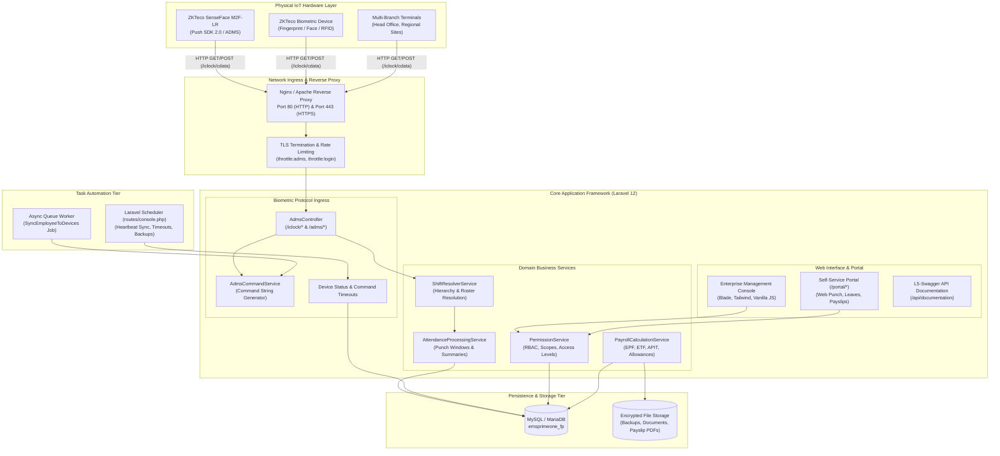
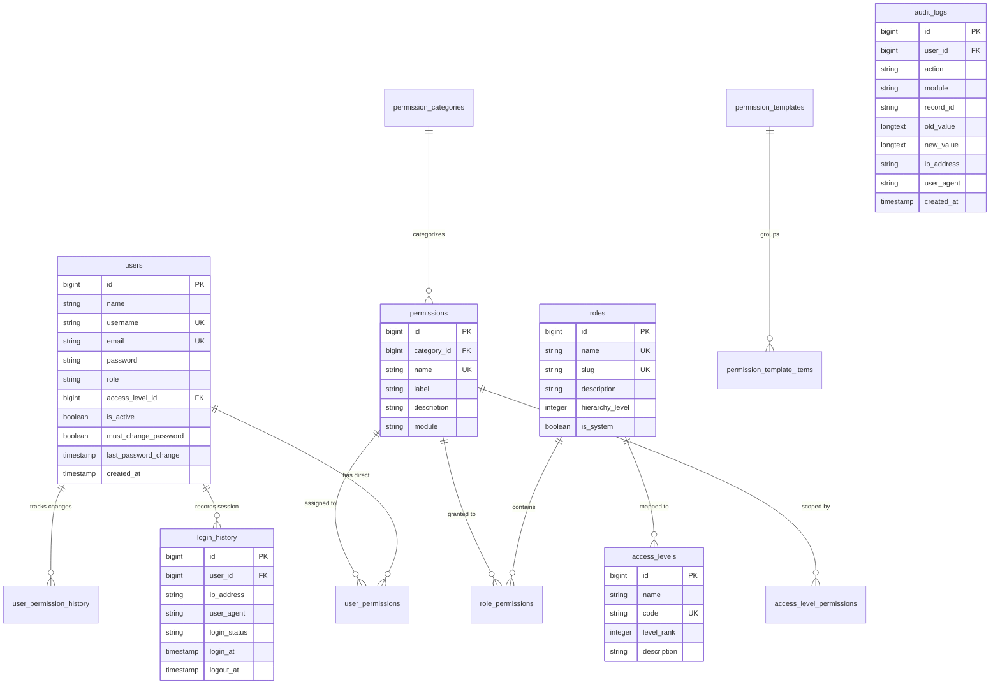
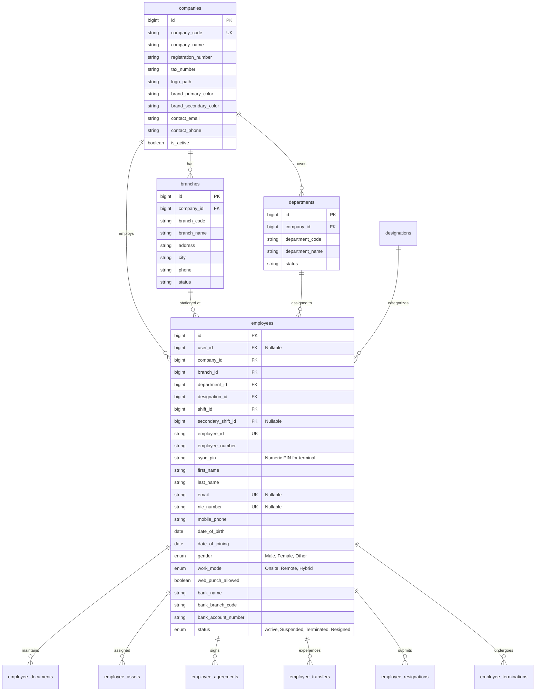
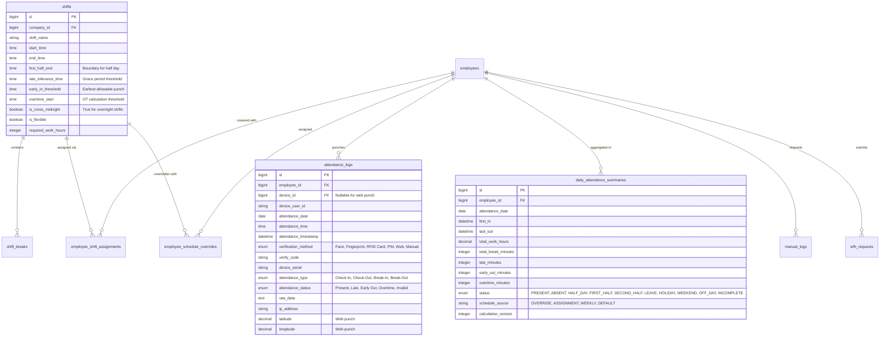

# Attendance & Workforce Management System (AMS)
## Document 02: System Reference Document (SRD)

| Document Metadata | Details |
| :--- | :--- |
| **System Name** | Attendance Management System (AMS) - Biometric, Workforce & Payroll Platform |
| **Current Version** | V2.4 (Enterprise Edition) |
| **Engine** | Laravel 12.x / PHP 8.2+ / MySQL 8.0+ / MariaDB 10.4+ |
| **Document Purpose** | Comprehensive System Architecture, Data Catalog, API Specification & Security Reference |
| **Author** | Senior Engineering & Architecture Team |
| **Classification** | Confidential / Technical Reference Manual |

---

## 1. Architectural Design & Topology

The **Attendance Management System (AMS)** is architected as an event-driven, multi-tenant enterprise system bridging physical IoT biometric hardware (ZKTeco SenseFace M2F-LR) with modern web-based workforce administration, advanced scheduling, and statutory financial compliance.



---

## 2. Comprehensive Database Schema & Entity Catalog

The AMS database comprises 101 migration phases organized across 8 relational domains. All tables use InnoDB storage engine with `utf8mb4_unicode_ci` character encoding.

### 2.1 Core Identity, Security & RBAC Domain



### 2.2 Organization & Workforce Hierarchy Domain



### 2.3 Biometric Hardware & Device Protocol Domain

| Table Name | Primary Purpose | Key Fields |
| :--- | :--- | :--- |
| `devices` | Registers physical biometric terminals and stores hardware telemetry | `id`, `company_id`, `branch_id`, `device_name`, `device_serial_number` (UK), `ip_address`, `public_ip_address`, `port`, `firmware_version`, `user_count`, `face_count`, `fingerprint_count`, `device_attendance_count`, `status` (`Online`, `Offline`, `Pending Approval`, `Disabled`), `health_score`, `last_seen` |
| `device_commands` | Outbound asynchronous FIFO queue for ZKTeco ADMS terminal commands | `id`, `device_id` (FK), `command` (Text), `status` (`pending`, `sent`, `completed`, `failed`, `timeout`), `retry_count`, `sent_at`, `completed_at`, `execution_time_ms`, `failure_reason` |
| `device_event_logs` | Audit trail of raw hardware heartbeats, connection attempts, and alarms | `id`, `device_id` (FK), `event_type`, `severity` (`Info`, `Warning`, `Critical`), `event_message`, `raw_payload` (LongText), `created_at` |
| `biometric_templates` | Stores binary/encoded biometric template data for centralized backup & sync | `id`, `employee_id` (FK), `device_id` (FK), `biometric_type` (`Face`, `Fingerprint`, `Palm`, `Card`), `finger_index`, `template_data` (LongText), `template_version`, `checksum_sha256` |
| `device_groups` | Logical grouping of terminals for mass schedule or user synchronization | `id`, `group_name`, `description` |
| `device_settings` | Terminal-specific operational flags (volume, language, timeout) | `id`, `device_id` (FK), `setting_key`, `setting_value` |

### 2.4 Scheduling & Attendance Engine Domain



### 2.5 Sri Lankan Statutory Payroll Domain

| Table Name | Primary Purpose | Key Fields |
| :--- | :--- | :--- |
| `salary_profiles` | Base compensation parameters and recurring allowances/deductions | `id`, `employee_id` (FK), `basic_salary`, `budgetary_relief_allowance`, `travel_allowance`, `food_allowance`, `attendance_incentive`, `is_epf_eligible`, `effective_date`, `status` |
| `payroll_periods` | Monthly payroll execution containers and governance cycle | `id`, `company_id` (FK), `period_code` (`2026-06`), `start_date`, `end_date`, `cut_off_date`, `working_days`, `status` (`Draft`, `Processing`, `HR Review`, `Approved`, `Locked`), `approved_by`, `approved_at` |
| `payroll_runs` | Individual calculation batch run history with audit parameters | `id`, `payroll_period_id` (FK), `run_type` (`Full`, `Selective`, `Recalculate`), `processed_employees_count`, `total_net_payable`, `status` |
| `payslips` | Fully computed monthly payslip records | `id`, `uuid` (Verifiable token), `payroll_period_id` (FK), `employee_id` (FK), `basic_salary`, `nopay_days`, `nopay_deduction`, `gross_salary`, `epf_employee_amount` (8%), `epf_employer_amount` (12%), `etf_employer_amount` (3%), `apit_tax_amount`, `normal_ot_hours`, `double_ot_hours`, `total_ot_amount`, `net_salary`, `qr_code_hash` |
| `tax_years` & `tax_brackets` | Sri Lanka Inland Revenue Department (IRD) APIT progressive tax brackets | `id`, `tax_year_id` (FK), `bracket_order`, `min_income`, `max_income`, `tax_rate_percentage`, `base_tax_amount` |

---

## 3. Hardware & Communication API Catalog

### 3.1 ZKTeco ADMS Protocol Endpoints

These endpoints service direct communication from physical biometric terminals using the ZKTeco PUSH / ADMS protocol.

#### 1. Device Handshake & Configuration Sync
- **Endpoint**: `GET /iclock/cdata` (Alias: `GET /adms/cdata`)
- **Middleware**: `throttle:adms` (Exempt from CSRF)
- **Parameters**:
  * `SN` (Query, Required): Device Serial Number (e.g., `SN=VAL_M2FLR_999`).
- **Response**:
  ```http
  HTTP/1.1 200 OK
  Content-Type: text/plain

  GET OPTION FROM: VAL_M2FLR_999
  Stamp=9999
  OpStamp=9999
  PhotoStamp=9999
  ErrorDelay=60
  Delay=30
  TransTimes=00:00;14:05
  TransInterval=1
  TransFlag=TransData AttLog\tOpLog\tAttPhoto\tEnrollUser\tChgUser\tEnrollFP\tChgFP\tFACE\tUserPic
  TimeZone=330
  Realtime=1
  Encrypt=0
  ```

#### 2. Real-Time Transaction Push (Attendance Log Upload)
- **Endpoint**: `POST /iclock/cdata` (Alias: `POST /adms/cdata`)
- **Query Parameters**: `SN={Serial}&table=ATTLOG`
- **Request Body (Tab-delimited text)**:
  ```text
  <DeviceUserId>\t<Timestamp>\t<PunchType>\t<VerifyType>\t<WorkCode>\t<Reserved>
  P1-01\t2026-06-15 08:30:00\t0\t15\t0\t0
  P1-02\t2026-06-15 08:50:00\t0\t1\t0\t0
  ```
- **Verification Type Mapping**:
  * `15`: Face Scan
  * `1`: Fingerprint Scan
  * `4`: RFID Smart Card
  * `3`: Password / PIN
- **Response**:
  ```http
  HTTP/1.1 200 OK
  Content-Type: text/plain

  OK: 2
  ```

#### 3. Outbound Command Polling (Device Heartbeat)
- **Endpoint**: `GET /iclock/getrequest` (Alias: `GET /adms/getrequest`)
- **Query Parameters**: `SN={Serial}`
- **Behavior**:
  1. Updates the device `last_seen` timestamp and captures client `public_ip_address`.
  2. If status is `Offline`, transitions device status to `Online`.
  3. Queries the `device_commands` table for oldest `pending` command targeted to this terminal.
  4. Marks command status as `sent` and returns command payload.
- **Response (When command is pending)**:
  ```http
  HTTP/1.1 200 OK
  Content-Type: text/plain

  C:142:DATA UPDATE USERINFO PIN=101	Name=John Doe	Pri=0	Grp=1	TZ=0
  ```
- **Response (When no commands pending)**:
  ```http
  HTTP/1.1 200 OK
  Content-Type: text/plain

  OK
  ```

#### 4. Command Execution Callback
- **Endpoint**: `POST /iclock/devicecmd` (Alias: `POST /adms/devicecmd`)
- **Query Parameters**: `SN={Serial}`
- **Request Body**:
  ```text
  ID=142&Return=0&CMD=DATA UPDATE USERINFO
  ```
- **Behavior**: Parses command return code (`Return=0` indicates success; non-zero indicates error), updates `execution_time_ms`, updates terminal storage/user counts, and marks command as `completed` or `failed`.
- **Response**: `OK`

---

## 4. Security, Access Control & Governance Matrix

### 4.1 Role-Based Access Control (RBAC) Architecture

The system enforces a 3-dimensional authorization model:
$$\text{Authorized} \iff \text{Role Has Permission} \land \text{User Access Level} \ge \text{Action Level} \land \text{Resource Within Scope}$$

| Role | Intended Users | Primary Capabilities |
| :--- | :--- | :--- |
| **Super Administrator** | Group IT & Systems Lead | Full access across all companies, system settings, database backups, audit logs, and hardware device registration. Account protected against deletion. |
| **Company Administrator** | Subsidiary HR Director / Operations Head | Company-wide workforce management, shift configurations, attendance approvals, and payroll period execution within assigned `company_id`. |
| **Branch / Site Manager** | Facility / Factory Managers | View branch attendance, approve manual punch requests, assign daily rosters, and inspect local device statuses. |
| **Department Head** | Department Managers / Team Leads | Review team leaves, approve WFH requests, view department daily attendance summaries. |
| **Payroll Officer** | Finance & Payroll Specialists | Review attendance variations, manage salary profiles, process monthly payroll runs, generate statutory EPF/ETF reports, and download bank export files. |
| **Employee** | General Staff Members | Restricted to Self-Service Portal (`/portal/*`): view personal roster, submit leave/WFH requests, clock web punch (if enabled), and download PDF payslips. |

### 4.2 Core Permission Taxonomy

Permissions are formatted using standard dot-notation: `<module>.<action>`

- `dashboard.view`
- `company.view`, `company.create`, `company.edit`, `company.delete`
- `employee.view`, `employee.create`, `employee.edit`, `employee.delete`
- `device.view`, `device.register`, `device.approve`, `device.disable`, `device.commands`
- `attendance.view`, `attendance.edit`, `attendance.delete`, `attendance.recalculate`
- `payroll.view`, `payroll.process`, `payroll.approve`, `payroll.lock`
- `admin.users`, `admin.roles`, `admin.permissions`, `admin.settings`, `admin.backups`

---

## 5. Background Automation & Scheduled Tasks

All system automation routines are registered in `routes/console.php` and executed via the unified Laravel Scheduler.

```mermaid
gantt
    title Scheduled Task Execution Frequency
    dateFormat HH:mm
    axisFormat %H:%M

    section Every Minute
    app:check-command-timeouts :active, 00:00, 00:01
    app:update-device-statuses :active, 00:00, 00:01

    section Daily 01:00 AM
    app:backup (Automated DB Dump) :01:00, 01:10

    section Daily 02:00 AM
    holidays:sync (Current Year) :02:00, 02:05
    holidays:sync (Upcoming Year) :02:15, 02:20

    section Daily Midnight
    app:cleanup-old-events (30d Purge) :00:05, 00:10
```

| Schedule Expression | Artisan Command | Description |
| :--- | :--- | :--- |
| `* * * * *` (Every Minute) | `app:check-command-timeouts` | Inspects outbound commands in `sent` state older than 180 seconds; increments `retry_count` or marks `timeout`. |
| `* * * * *` (Every Minute) | `app:update-device-statuses` | Checks `last_seen` timestamp of all terminals; sets status to `Offline` if no heartbeat received for > 10 minutes. |
| `0 1 * * *` (Daily at 01:00) | `app:backup` | Generates a compressed MySQL dump in `storage/app/backups/`, verifies dump integrity, and updates `backups` catalog. |
| `0 2 * * *` (Daily at 02:00) | `holidays:sync` | Queries government/commercial holiday APIs to update `holidays` table for current calendar year. |
| `15 2 * * *` (Daily at 02:15) | `holidays:sync --year={next}` | Synchronizes statutory holiday dates for the upcoming calendar year. |
| `0 0 * * *` (Daily Midnight) | `app:cleanup-old-events` | Soft-deletes `device_event_logs` records older than 30 days to optimize database index sizing. |

---

## 6. Audit Logging & System Diagnostics Architecture

### 6.1 Audit Trail Implementation
Audit logs are recorded synchronously via `App\Models\AuditLog` upon all administrative state mutations:
```php
AuditLog::create([
    'user_id'    => auth()->id() ?? 1,
    'action'     => 'UPDATE_SALARY_PROFILE',
    'module'     => 'Payroll Management',
    'record_id'  => $profile->id,
    'old_value'  => json_encode($originalAttributes),
    'new_value'  => json_encode($updatedAttributes),
    'ip_address' => request()->ip(),
    'user_agent' => request()->userAgent(),
]);
```

### 6.2 Hardware Event Logging
Hardware interactions are recorded in `device_event_logs` with severity levels:
- `Info`: Standard device connection, successful command completion, handshake.
- `Warning`: Retried commands, heartbeat delays, firmware configuration mismatch.
- `Critical`: Terminal tamper alerts, storage capacity $\ge 95\%$, repeated command rejections.

### 6.3 Diagnostic Artisan Commands
The platform includes built-in diagnostic and validation commands:
```bash
# Execute comprehensive 8-phase production readiness test
php artisan app:validate-production

# Simulate biometric hardware traffic from mock terminal
php artisan app:simulate-adms-device --sn=SIM_M2F_001

# Inspect and verify payroll calculations against statutory formulas
php artisan app:verify-payroll-migration
```
