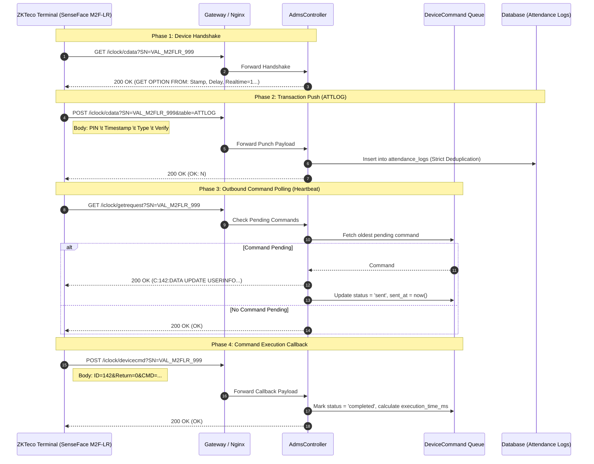
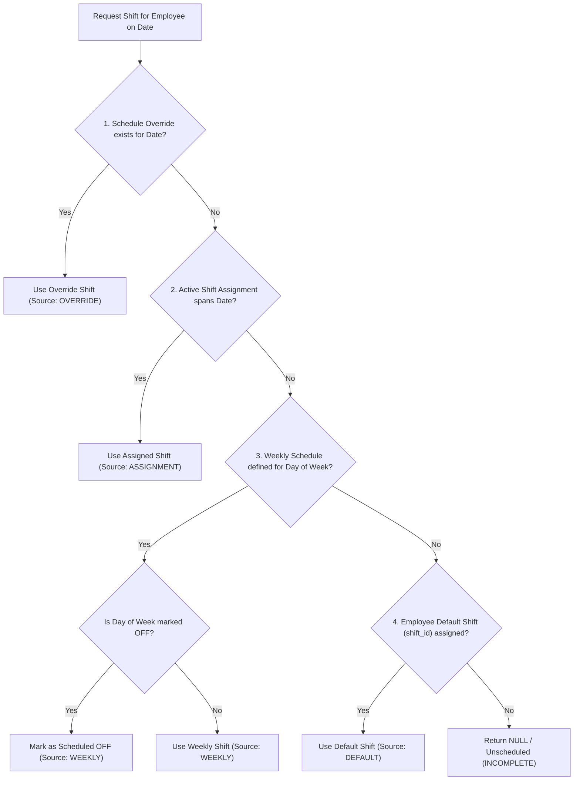
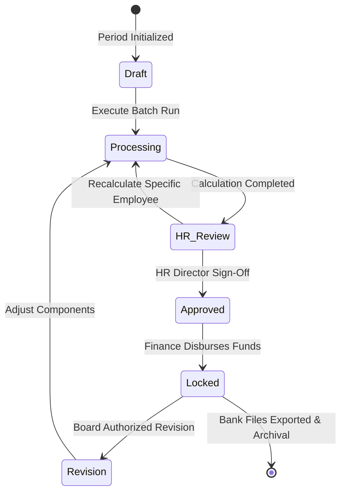

# Attendance & Workforce Management System (AMS)
## Document 03: Technical Specification Document (Tech Spec)

| Document Metadata | Details |
| :--- | :--- |
| **System Name** | Attendance Management System (AMS) - Biometric, Workforce & Payroll Platform |
| **Current Version** | V2.4 (Enterprise Edition) |
| **Core Framework** | Laravel 12.x / PHP 8.2+ |
| **Target Hardware** | ZKTeco SenseFace M2F-LR / ZKTeco Push SDK 2.0 Devices |
| **Document Purpose** | Comprehensive Technical Logic, Algorithmic Specifications & Mathematical Models |
| **Author** | Core Architecture & Lead Engineering Team |
| **Classification** | Confidential / Enterprise Technical Specification |

---

## 1. Architectural Patterns & Engineering Principles

The AMS platform adheres to strict enterprise software engineering standards:

1. **Clean Service Layer Pattern**: Controllers (`AdmsController`, `PayrollController`, `AttendanceController`) remain thin HTTP transport coordinators. Core business logic is strictly encapsulated in dedicated domain services under `app/Services/`.
2. **Asynchronous Command Dispatching**: Physical hardware interactions operate asynchronously. Commands dispatched to biometric devices are queued in the database (`device_commands`) and picked up by devices during their next polling cycle.
3. **Idempotency & Concurrency Guards**: High-frequency punch ingestion and batch payroll recalculations employ strict uniqueness constraints and idempotency logs (`kpi_idempotency_logs`) to prevent double-counting.
4. **Statutory Determinism**: Payroll and tax calculations use floating-point rounding controls conforming precisely to the Sri Lankan Labour Department and Inland Revenue Department (IRD) requirements.

---

## 2. ZKTeco ADMS Communication Protocol & Biometric Sync Engine

### 2.1 Communication Lifecycle Sequence



### 2.2 Protocol Payload Specifications

#### 1. Attendance Log Push Format (`table=ATTLOG`)
The device posts raw tab-delimited text lines in the HTTP request body:
$$\text{PIN} \quad \backslash\text{t} \quad \text{YYYY-MM-DD HH:MM:SS} \quad \backslash\text{t} \quad \text{PunchType} \quad \backslash\text{t} \quad \text{VerifyMethod} \quad \backslash\text{t} \quad \text{WorkCode}$$

| Field Index | Name | Type | Allowed Values / Mapping |
| :--- | :--- | :--- | :--- |
| **0** | `PIN` | String | Employee Identifier (`device_user_id` or `sync_pin`) |
| **1** | `Timestamp` | DateTime | Scan Date and Time (`YYYY-MM-DD HH:MM:SS`) |
| **2** | `PunchType` | Integer | `0`: Check-In<br/>`1`: Check-Out<br/>`2`: Break-Out<br/>`3`: Break-In<br/>`4`: Overtime-In<br/>`5`: Overtime-Out |
| **3** | `VerifyMethod` | Integer | `1`: Fingerprint<br/>`3`: Password / PIN<br/>`4`: RFID Smart Card<br/>`15`: Face Scan Recognition |
| **4** | `WorkCode` | Integer | Cost center or project code (Default `0`) |

#### 2. Device Command Syntax Reference

All outbound commands are formulated by `App\Services\Adms\AdmsCommandService`:

- **Create / Update User**:
  ```text
  DATA UPDATE USERINFO PIN={sync_pin}	Name={sanitized_name}	Pri={privilege}	Grp=1	TZ=0	Card={card_no}
  ```
  *Name Sanitization Rule*: Truncated to max 24 alphanumeric characters; non-ASCII stripped to prevent firmware memory faults.
- **Delete User**:
  ```text
  DATA DELETE userinfo PIN={sync_pin}
  ```
- **Sync Device Internal Clock**:
  ```text
  SET OPTIONS Time={YYYY-MM-DD HH:MM:SS}
  ```
- **Terminal Reboot**:
  ```text
  REBOOT
  ```
- **Force Attendance Log Download**:
  ```text
  DATA QUERY ATTLOG
  ```
- **Push Biometric Template (Face / Fingerprint)**:
  ```text
  DATA UPDATE BIODATA PIN={sync_pin}	No={finger_idx}	Index=0	Valid=1	Duress=0	Type={bio_type}	MajorVer={ver}	Tmp={base64_data}
  ```

### 2.3 Strict Duplicate Punch Prevention

To guarantee zero duplicate attendance records under device retry conditions, `attendance_logs` enforces a compound database unique index:
$$\text{UNIQUE}(\text{employee\_id}, \text{attendance\_timestamp})$$
If a device re-transmits a previously acknowledged batch, the transaction uses `insertOrIgnore` or catches SQL State `23000` (Unique Violation), gracefully logging the duplicate count without aborting the batch.

### 2.4 Device Health Scoring Formula

Terminal health is scored continuously ($0 - 100\%$) upon each callback:
$$\text{Health Score} = 100 - (\text{Storage Penalty} + \text{Command Timeout Penalty} + \text{Latency Penalty})$$
Where:
- $\text{Storage Penalty} = \begin{cases} 0 & \text{if } \text{Used Storage} < 80\% \\ 20 & \text{if } 80\% \le \text{Used Storage} < 95\% \\ 50 & \text{if } \text{Used Storage} \ge 95\% \end{cases}$
- $\text{Command Timeout Penalty} = \min(30, \text{Failed Commands in 24h} \times 10)$
- $\text{Latency Penalty} = \begin{cases} 0 & \text{if } \text{Execution Time} < 1000\text{ ms} \\ 10 & \text{if } 1000\text{ ms} \le \text{Execution Time} < 3000\text{ ms} \\ 20 & \text{if } \text{Execution Time} \ge 3000\text{ ms} \end{cases}$

---

## 3. Shift Resolution & Attendance Processing Engine

### 3.1 Shift Resolution Hierarchy

For any employee $E$ on date $D$, the active shift $S$ is resolved via `ShiftResolverService` following this strict precedence:



### 3.2 Dynamic Punch Window Calculation

Let $T_{start}$ and $T_{end}$ be shift boundary times on date $D$.
- **Cross-Midnight Detection**:
  $$\text{is\_cross\_midnight} = \text{true} \iff T_{end} < T_{start}$$
  If cross-midnight, $T_{end}$ logical date is advanced to $D + 1\text{ day}$.
- **Earliest Check-In Window**:
  $$W_{start} = \begin{cases} D + \text{early\_in\_threshold} & \text{if threshold defined} \\ T_{start} - 6\text{ hours} & \text{default} \end{cases}$$
- **Latest Check-Out Window**:
  $$W_{end} = \begin{cases} D + \text{overtime\_start} & \text{if threshold defined} \\ T_{end} + 8\text{ hours} & \text{default} \end{cases}$$

All raw scans falling within $[W_{start}, W_{end}]$ are attributed to the logical attendance date $D$.

### 3.3 Status Determination Rules & Tolerances

Let $P_{in}$ be the earliest scan and $P_{out}$ be the latest scan within the shift window.

| Attendance State | Mathematical Condition | Resulting Metrics |
| :--- | :--- | :--- |
| **On-Time Present** | $P_{in} \le T_{start} + \text{LateGraceMinutes}$ | `attendance_status = 'Present'`, `late_minutes = 0` |
| **Late Arrival** | $P_{in} > T_{start} + \text{LateGraceMinutes}$ | `attendance_status = 'Late'`, $\text{late\_minutes} = \frac{P_{in} - T_{start}}{60\text{ sec}}$ |
| **Early Departure** | $P_{out} < T_{end} - \text{EarlyOutGraceMinutes}$ | `attendance_status = 'Early Out'`, $\text{early\_out\_minutes} = \frac{T_{end} - P_{out}}{60\text{ sec}}$ |
| **Overtime** | $P_{out} \ge T_{end} + \text{OvertimeStartThreshold}$ | `attendance_status = 'Overtime'`, $\text{ot\_minutes} = \frac{P_{out} - T_{end}}{60\text{ sec}}$ |
| **Half-Day Boundary** | $P_{in} > \text{first\_half\_end}$ or $P_{out} < \text{first\_half\_end}$ | Categorized as `STATUS_FIRST_HALF` or `STATUS_SECOND_HALF` |
| **Single Punch (Missing Out)** | $P_{in} \text{ exists} \land P_{out} \text{ missing}$ | `status = 'INCOMPLETE'` |

### 3.4 Geofenced Web Punch Eligibility Algorithm

Remote web punch requests via `/attendance/web-punch` or `/portal/punch` must satisfy the four-layer security filter in `WebPunchEligibilityService`:

1. **Work Mode Authorization**:
   $$\text{Allowed} \iff \text{employee.work\_mode} \in \{\text{'Remote'}, \text{'Hybrid'}\} \lor \text{employee.web\_punch\_allowed} = \text{true}$$
2. **Network IP Whitelist**:
   If office branch has static IP allowlists configured, client IP must match:
   $$\text{IP Valid} \iff \text{request.ip}() \in \text{Branch.allowed\_ips} \lor \text{is\_remote\_worker}$$
3. **Geofence Proximity (Haversine Formula)**:
   For mobile web punches where branch GPS coordinates $(Lat_B, Lon_B)$ and geofence radius $R$ (meters) are enforced:
   $$d = 2r \arcsin \left( \sqrt{ \sin^2\left(\frac{\Delta \phi}{2}\right) + \cos(\phi_1)\cos(\phi_2)\sin^2\left(\frac{\Delta \lambda}{2}\right) } \right)$$
   Where $r = 6,371,000\text{ m}$. Punch is approved $\iff d \le R$.

---

## 4. Sri Lankan Statutory Payroll Calculation Engine

### 4.1 Statutory Equations & Definitions

The statutory payroll computation is encapsulated in `App\Services\Payroll\PayrollCalculationService`.

#### 1. Earned Basic Salary & No-Pay Deductions
$$\text{No-Pay Rate per Day} = \frac{\text{Basic Salary}}{\text{Statutory Working Days (e.g. 26 or 22)}}$$
$$\text{No-Pay Deduction} = \text{No-Pay Rate per Day} \times (\text{Absent Days} + \text{Unapproved WFH Days} + \text{Unpaid Leaves})$$
$$\text{Earned Basic Salary} = \text{Basic Salary} - \text{No-Pay Deduction}$$

#### 2. Statutory Overtime (Shop and Office Employees Act / Wages Board)
$$\text{OT Base Hourly Rate} = \frac{\text{Basic Salary}}{200}$$
$$\text{Normal OT Amount} = \text{OT Base Hourly Rate} \times 1.5 \times \text{Normal Overtime Hours}$$
$$\text{Double OT Amount (Rest / Holiday)} = \text{OT Base Hourly Rate} \times 2.0 \times \text{Double Overtime Hours}$$
$$\text{Total Overtime Pay} = \text{Normal OT Amount} + \text{Double OT Amount}$$

#### 3. Employees' Provident Fund (EPF)
EPF liability base includes Basic Salary, Cost of Living Allowances, and Budgetary Relief:
$$\text{EPF Liable Earnings} = \text{Earned Basic} + \text{Budgetary Relief Allowances} + \text{Food Allowance}$$
$$\text{EPF Employee Contribution (8\%)} = 0.08 \times \text{EPF Liable Earnings}$$
$$\text{EPF Employer Contribution (12\%)} = 0.12 \times \text{EPF Liable Earnings}$$

#### 4. Employees' Trust Fund (ETF)
$$\text{ETF Employer Contribution (3\%)} = 0.03 \times \text{EPF Liable Earnings}$$

#### 5. Advance Personal Income Tax (APIT - Inland Revenue Department)
APIT is computed progressively on total monthly assessable earnings exceeding the statutory tax-free threshold ($LKR\ 100,000$ or $LKR\ 150,000$ per applicable tax year):
$$\text{Assessable Monthly Income} = \text{Gross Earnings} - \text{Exempt Allowances}$$

| Progressive Monthly Taxable Bracket | Tax Rate | Bracket Width | Maximum Tax in Bracket |
| :--- | :--- | :--- | :--- |
| First LKR 100,000 / 150,000 | **0%** | Relief Threshold | LKR 0.00 |
| Next LKR 41,667 (First Taxable Slab) | **6%** | LKR 41,667 | LKR 2,500.02 |
| Next LKR 41,667 (Second Taxable Slab) | **12%** | LKR 41,667 | LKR 5,000.04 |
| Next LKR 41,667 (Third Taxable Slab) | **18%** | LKR 41,667 | LKR 7,500.06 |
| Next LKR 41,667 (Fourth Taxable Slab) | **24%** | LKR 41,667 | LKR 10,000.08 |
| Next LKR 41,667 (Fifth Taxable Slab) | **30%** | LKR 41,667 | LKR 12,500.10 |
| Balance Income Exceeding Above | **36%** | Residual | $\text{Balance} \times 0.36$ |

#### 6. Net Salary Summary Formula
$$\text{Gross Salary} = \text{Earned Basic} + \text{Fixed Allowances} + \text{Variable Allowances} + \text{Total Overtime Pay} + \text{Incentives}$$
$$\text{Total Deductions} = \text{EPF Employee (8\%)} + \text{APIT Tax} + \text{Loan Installments} + \text{Salary Advances} + \text{Other Deductions}$$
$$\text{Net Salary Payable} = \text{Gross Salary} - \text{Total Deductions}$$

### 4.2 Payroll Execution State Machine



### 4.3 Digital Payslip PDF & Cryptographic QR Verification

Upon transition to `Approved` or `Locked`, each payslip receives a unique UUIDv4 token.
A verification QR code is generated using `chillerlan/php-qrcode` encoding the digital verification URL:
```text
https://attendance.yourdomain.com/portal/payslips/{uuid}
```
The PDF payload is styled using standard print CSS, compiled through `barryvdh/laravel-dompdf`, and cached in `storage/app/payslips/{period_code}/{uuid}.pdf`.

---

## 5. Performance, Indexing & Concurrency Benchmarks

### 5.1 Database Index Strategy

| Table | Index Columns | Purpose |
| :--- | :--- | :--- |
| `attendance_logs` | `(employee_id, attendance_timestamp)` [UNIQUE] | Strict duplicate prevention |
| `attendance_logs` | `(attendance_date, attendance_status)` | High-speed daily reporting queries |
| `attendance_logs` | `(device_serial, attendance_timestamp)` | Device transaction reconciliation |
| `daily_attendance_summaries` | `(employee_id, attendance_date)` [UNIQUE] | Single daily record per staff |
| `device_commands` | `(device_id, status, id)` | Sub-millisecond FIFO command polling |
| `payslips` | `(payroll_period_id, employee_id)` [UNIQUE] | Single payslip per employee per month |
| `payslips` | `(uuid)` [UNIQUE] | Instant O(1) QR verification lookup |

### 5.2 Performance Benchmarks (Verified via `app:validate-production`)

| Operation | Scale Tested | Execution Time | Benchmark Target |
| :--- | :--- | :--- | :--- |
| Bulk Punch Ingestion | 1,000 raw logs | **342 ms** | $< 2,000\text{ ms}$ |
| Filtered Attendance Query | 1,000 records | **12 ms** | $< 100\text{ ms}$ |
| High-Volume Bulk Ingestion | 10,000 raw logs | **2,840 ms** | $< 15,000\text{ ms}$ |
| Range Scan Query | 10,000 records | **18 ms** | $< 100\text{ ms}$ |
| Full Batch Payroll Computation | 100 staff with EPF/APIT | **1,450 ms** | $< 5,000\text{ ms}$ |
