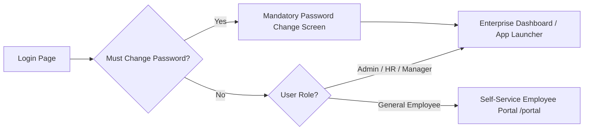
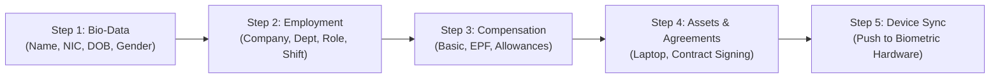
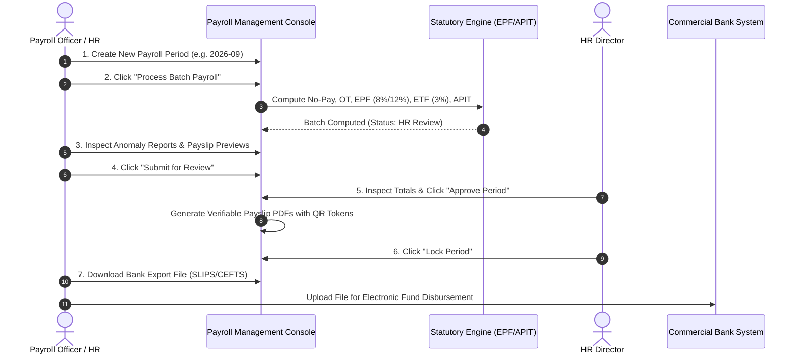

# Attendance & Workforce Management System (AMS)
## Document 05: HR & User Operations Manual

| Document Metadata | Details |
| :--- | :--- |
| **System Name** | Attendance Management System (AMS) - Biometric, Workforce & Payroll Platform |
| **Current Version** | V2.4 (Enterprise Edition) |
| **Intended Audience** | HR Managers, Payroll Officers, Branch Managers, Department Heads, General Staff |
| **Document Purpose** | Comprehensive Step-by-Step Graphical User Interface (UI) Operational Guide |
| **Classification** | Enterprise Operational User Manual |

---

## 1. System Access & Authentication

### 1.1 Logging In to the Enterprise Console
1. Open your web browser (Google Chrome, Microsoft Edge, or Mozilla Firefox recommended) and navigate to:
   ```text
   https://attendance.yourdomain.com/login
   ```
2. Enter your **Username** (or Work Email) and **Password**.
   *(If your company utilizes Enterprise Single Sign-On, click **Continue with SSO / WSO2**)*.
3. Click **Sign In**.



### 1.2 Mandatory First-Time Password Reset
Upon your initial login or when an administrator resets your account:
1. The system redirects to the **Password Change Screen** (`/password/change`).
2. Enter your **Current Password**.
3. Enter your **New Password** meeting corporate complexity criteria:
   - Minimum 8 characters in length.
   - At least one uppercase letter, one lowercase letter, one numeric digit, and one special character (`@`, `#`, `$`, `%`).
4. Re-enter the new password in **Confirm New Password** and click **Update Password**.

---

## 2. Organization & Master Data Setup

Before onboarding staff, ensure the organizational hierarchy is configured in the Admin Console:

### 2.1 Managing Companies & Branches
- **Navigate**: **Organization** $\rightarrow$ **Companies** (`/companies`)
- **Add Company**: Click **+ Add New Company**. Enter Company Name (e.g., *Prime One Global*), Company Code (*P1*), Tax ID, and upload the corporate branding logo.
- **Add Branch**: Navigate to **Organization** $\rightarrow$ **Branches** (`/branches`). Click **+ Add Branch**. Select the parent company, branch name (e.g., *Head Office*), city, and IP range for geofencing.

### 2.2 Managing Departments & Designations
- **Departments** (`/departments`): Create functional teams (e.g., *Software Engineering*, *Human Resources*, *Finance*, *Operations*).
- **Designations** (`/designations`): Create specific job roles (e.g., *Senior Software Engineer*, *HR Executive*, *Branch Accountant*).

---

## 3. Employee Onboarding & Lifecycle Management

AMS V2.4 provides a digital **Onboarding Wizard** (`/onboarding/wizard`) to streamline employee hiring.



### 3.1 Step-by-Step Onboarding Walkthrough
1. Navigate to **Workforce** $\rightarrow$ **Onboarding Wizard** (`/onboarding/wizard`).
2. **Step 1: Personal Particulars**:
   - Enter Full Name, Date of Birth, Gender, National Identity Card (NIC) number, Mobile Phone, and Personal/Work Email.
3. **Step 2: Organizational Placement**:
   - Select **Company**, **Branch**, **Department**, and **Designation**.
   - Select the **Primary Work Mode** (*Onsite*, *Remote*, *Hybrid*).
   - If allowed to punch from browser, enable **Allow Web Punch**.
   - Assign the **Primary Default Shift** (e.g., *Morning Standard Shift 08:30 - 17:30*).
4. **Step 3: Statutory & Banking Particulars**:
   - Enter Bank Name, Bank Branch Code, and Bank Account Number for salary transfers.
   - Enter Employee EPF Number (if applicable).
5. **Step 4: Asset Allocation & Document Generation**:
   - Assign physical assets (e.g., *Laptop Model, Serial Number, Charger, ID Badge*).
   - Click **Generate Agreement** to create a formalized employment contract from active templates.
   - The employee or HR can digitally sign the document, which saves a permanent PDF in the employee profile.
6. **Step 5: Terminal Biometric Synchronization**:
   - Click **Complete & Sync to Terminals**.
   - The system generates an automatic `DATA UPDATE USERINFO` command dispatched to all approved terminals assigned to the employee's branch.

---

## 4. Shift & Roster Configuration

### 4.1 Creating a Shift Definition
Navigate to **Shifts & Scheduling** $\rightarrow$ **Shift Configurations** (`/shifts`):
1. Click **+ Add Shift**.
2. Configure the shift timing parameters:
   - **Shift Name**: e.g., *Standard Day Shift*.
   - **Start Time**: e.g., `08:30`.
   - **End Time**: e.g., `17:30`.
   - **Late Grace Period**: e.g., `15` minutes (Employees checking in before `08:45` are recorded as *Present* with zero late penalty).
   - **Overtime Start Threshold**: e.g., `30` minutes past end time (`18:00`).
   - **First Half Boundary (`first_half_end`)**: e.g., `13:00` (Used to evaluate half-day leaves or late arrivals).
   - **Is Cross-Midnight**: Check this box **ONLY** for overnight shifts (e.g., `20:00` to `05:00`).
3. Click **Save Shift**.

### 4.2 Assigning Weekly Schedules & Rosters
- **Weekly Schedule** (`/shifts/weekly`): Assign fixed recurring schedules per day of the week (e.g., Monday–Friday on *Standard Day Shift*, Saturday on *Half-Day Shift*, Sunday marked *Scheduled OFF*).
- **Ad-Hoc Schedule Overrides** (`/schedules`): If an employee is temporarily assigned to a night shift or weekend shift for a specific date, navigate to **Schedules** $\rightarrow$ **New Override**, pick the employee, select the target date, and pick the temporary shift. The system gives overrides highest priority.

---

## 5. Daily Attendance & Exception Monitoring

### 5.1 Real-Time Attendance Monitoring
Navigate to **Attendance** $\rightarrow$ **Daily Attendance** (`/daily-attendance`):
- Filter logs by **Date**, **Company**, **Branch**, or **Department**.
- High-level KPI cards show:
  * 🟢 **Present Count**: Employees with valid on-time punches.
  * 🟡 **Late Arrivals**: Employees who checked in past grace periods.
  * 🟠 **Early Departures**: Employees who clocked out before shift conclusion.
  * 🔵 **Overtime**: Employees who worked past the OT threshold.
  * 🔴 **Absent / Incomplete**: Employees with no check-in or missing check-out.

### 5.2 Approving Attendance Variations & Manual Punches
1. **Manual Punches** (`/manual-logs`):
   - When an employee forgets their biometric badge or works offsite without connectivity, they submit a manual punch request.
   - Review the employee's justification $\rightarrow$ Click **Approve** (updates daily attendance summary) or **Reject**.
2. **Work From Home (WFH) Approvals** (`/wfh`):
   - Review pending WFH requests $\rightarrow$ Click **Approve**.
   - Approved WFH automatically marks the employee as *Present (WFH)* on the target date, preventing no-pay salary deductions.

---

## 6. End-to-End Monthly Payroll Execution Runbook

The monthly payroll cycle is coordinated through **Payroll Management** (`/payroll`):



### Step 6.1: Initialize Payroll Period
1. Navigate to **Payroll** $\rightarrow$ **Payroll Periods** (`/payroll`).
2. Click **+ Create Period**.
3. Select the **Company**, enter the **Period Code** (e.g., `2026-09`), set the **Start Date** (`2026-09-01`), **End Date** (`2026-09-30`), and specify the statutory **Working Days** (e.g., `26`).
4. Click **Create Period** (Period status starts in `Draft`).

### Step 6.2: Execute Batch Calculation
1. On the period row, click **Process Payroll**.
2. The statutory engine automatically:
   - Queries `daily_attendance_summaries` to tally absent days and overtime hours.
   - Applies the statutory daily no-pay deduction:
     $$\text{No-Pay Deduction} = \frac{\text{Basic Salary}}{\text{Working Days}} \times \text{No-Pay Days}$$
   - Calculates Normal Overtime ($1.5\times$) and Double Overtime ($2.0\times$).
   - Calculates **EPF Employee (8%)**, **EPF Employer (12%)**, and **ETF Employer (3%)**.
   - Applies Inland Revenue Department (IRD) **APIT progressive tax brackets**.
3. Period transitions to `HR Review`.

### Step 6.3: Review Anomaly Reports & Individual Recalculation
1. Open the Period Details page (`/payroll/periods/{id}`).
2. Review the summary cards: Total Basic, Total Allowances, Total Overtime, Total Deductions, Total EPF/ETF, and Total Net Payable.
3. Review flagged employees (e.g. employees with $> 3$ no-pay days or $> 40$ OT hours).
4. If an employee had late manual adjustments approved after the initial run, click **Recalculate Employee** on that specific staff row without re-running the entire company.

### Step 6.4: Approval, Payslip Generation & Locking
1. Click **Submit for Review**.
2. The authorized HR Director reviews the audit log summary and clicks **Approve Period**.
3. The system generates:
   - Verifiable PDF payslips with embedded QR validation codes for all staff.
   - Individual payslips immediately appear in the employee's Self-Service Portal.
4. Once payments are disbursed, click **Lock Period**. Locked periods cannot be edited or recalculated, ensuring complete financial audit compliance.

### Step 6.5: Exporting Bank Files
1. On the locked period page, click **Export Bank File**.
2. Select your banking institution format:
   - **Commercial Bank SLIPS**
   - **Standard CEFTS CSV**
3. Upload the exported file directly into your corporate internet banking portal for automated salary disbursement.

---

## 7. Employee Self-Service Portal Guide

Staff members access the mobile-responsive Self-Service Portal at `/portal/dashboard`:

### 7.1 Clocking In via Web Punch
1. Navigate to **Portal** $\rightarrow$ **Web Punch** (`/portal/punch`).
2. Allow browser location access when prompted.
3. Click **Clock In** or **Clock Out**.
4. The system validates your location against the branch geofence, captures your timestamp, and displays an instant confirmation.

### 7.2 Applying for Leaves & WFH
1. **Apply for Leave** (`/portal/leave`):
   - Select Leave Type (*Annual*, *Casual*, *Medical*).
   - Select Start Date and End Date.
   - Enter reason and click **Submit Request**.
2. **Apply for WFH** (`/portal/wfh`):
   - Select target date and enter your planned remote deliverables.
   - Once your supervisor approves, your attendance is credited automatically.

### 7.3 Viewing & Downloading Payslips
1. Navigate to **Portal** $\rightarrow$ **Payslips** (`/portal/payslips`).
2. Your monthly payslips will be listed in chronological order.
3. Click **View** to inspect online or **Download PDF** to obtain the official encrypted payslip with the digital verification QR code.
