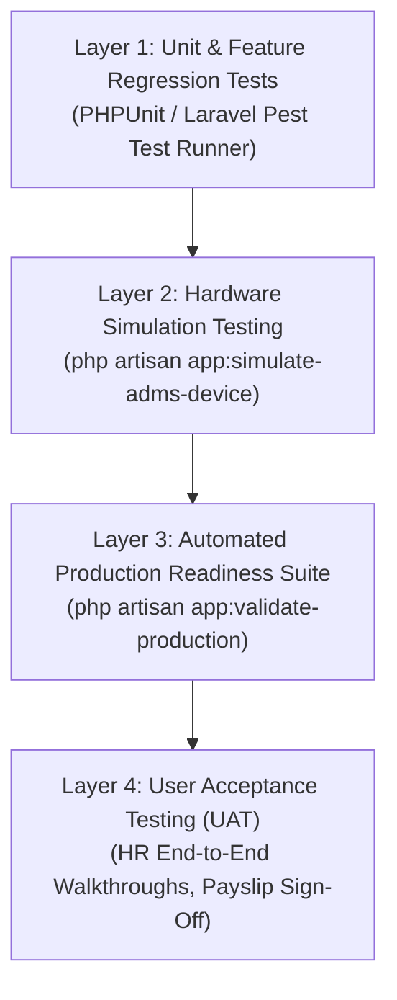

# Attendance & Workforce Management System (AMS)
## Document 06: QA & UAT Testing Playbook

| Document Metadata | Details |
| :--- | :--- |
| **System Name** | Attendance Management System (AMS) - Biometric, Workforce & Payroll Platform |
| **Current Version** | V2.4 (Enterprise Edition) |
| **Intended Audience** | QA Engineers, Test Automation Leads, UAT Evaluators, DevOps Engineers |
| **Document Purpose** | Comprehensive Test Matrix, Automated Validation Suites & UAT Verification Runbook |
| **Classification** | Enterprise Quality Assurance & Testing Manual |

---

## 1. Quality Assurance Strategy & Test Layers

The AMS platform incorporates a four-layer verification hierarchy ensuring zero regression across hardware, business algorithms, and compliance calculations:



---

## 2. Automated Test Execution Commands

### 2.1 Full Production Readiness Validation
The system includes an automated enterprise test runner that executes 25+ end-to-end integration tests, benchmarks database indexes, verifies security boundaries, and outputs a signed Markdown report:

```bash
# Execute production validation suite (test records preserved for UI inspection)
php artisan app:validate-production

# Execute production validation suite with automatic cleanup
php artisan app:validate-production --cleanup
```

### 2.2 Biometric Hardware Traffic Simulation
Simulate a physical ZKTeco SenseFace M2F-LR terminal pushing scans and polling commands:

```bash
# Simulate a new device connecting (tests auto-discovery and pending approval)
php artisan app:simulate-adms-device --sn=SIM_M2F_001

# Simulate real-time attendance punch batch for an employee
php artisan app:simulate-adms-device --sn=SIM_M2F_001 --employee=P1-01 --verify=face
```

### 2.3 Unit & Feature Test Suite
Run standard PHPUnit test suites:
```bash
php artisan config:clear --ansi
php artisan test
```

---

## 3. Comprehensive UAT Test Scenarios Matrix

### Test Suite 1: Biometric Hardware & ADMS Protocol

| Test ID | Scenario Description | Input / Trigger | Expected Result | Pass Criteria |
| :--- | :--- | :--- | :--- | :--- |
| **TC-HW-01** | Handshake without Serial Number | `GET /iclock/cdata` (No query params) | Returns HTTP 400 Bad Request with body `ERROR: SN required` | Unauthenticated requests without SN rejected |
| **TC-HW-02** | New Terminal Auto-Discovery | `GET /iclock/cdata?SN=TEST_DEV_01` | Device automatically registered in DB with status `Pending Approval` | New hardware quarantined until admin authorization |
| **TC-HW-03** | Terminal Heartbeat & `last_seen` Update | `GET /iclock/getrequest?SN={serial}` | Terminal `last_seen` timestamp updated to current time; public IP saved | Heartbeat tracks active device availability |
| **TC-HW-04** | Outbound Command Queueing & Dispatch | Queue command `#101: DATA UPDATE USERINFO`; call `GET /iclock/getrequest` | Controller returns `C:101:DATA UPDATE USERINFO...`; command status transitions to `sent` | FIFO command dispatching confirmed |
| **TC-HW-05** | Command Callback & Health Score | `POST /iclock/devicecmd` with `ID=101&Return=0` | Command status transitions to `completed`; `execution_time_ms` calculated; health score updated | Two-way command lifecycle completed |
| **TC-HW-06** | Command Timeout & Auto-Retry | Command in `sent` status for $> 180\text{ sec}$; trigger `app:check-command-timeouts` | Command status resets to `pending`; `retry_count` incremented | Resilient retry on network dropouts |

---

### Test Suite 2: Shift Resolution & Attendance Scans

| Test ID | Scenario Description | Shift Parameters | Punch Input | Expected Result |
| :--- | :--- | :--- | :--- | :--- |
| **TC-ATT-01** | On-Time Check-In (Within Grace) | Start: `08:30`, Grace: `15m` | Scan at `08:40:00` | `attendance_status = 'Present'`, `late_minutes = 0` |
| **TC-ATT-02** | Late Check-In (Past Grace) | Start: `08:30`, Grace: `15m` | Scan at `08:50:00` | `attendance_status = 'Late'`, `late_minutes = 20` |
| **TC-ATT-03** | On-Time Check-Out | End: `17:30`, EarlyGrace: `0m` | Scan at `17:35:00` | `attendance_status = 'Present'`, `attendance_type = 'Check-Out'` |
| **TC-ATT-04** | Early Departure | End: `17:30`, EarlyGrace: `0m` | Scan at `16:30:00` | `attendance_status = 'Early Out'`, `early_out_minutes = 60` |
| **TC-ATT-05** | Overtime Trigger | End: `17:30`, OT Threshold: `30m` | Scan at `19:00:00` | `attendance_status = 'Overtime'`, `ot_minutes = 90` |
| **TC-ATT-06** | Duplicate Scan Suppression | Same PIN & timestamp resent | Resend `TC-ATT-01` | HTTP 200 returned; DB records count remains strictly `1` |
| **TC-ATT-07** | Cross-Midnight Overnight Shift | Start: `20:00`, End: `05:00` (+1d) | Scan at `05:15:00` (Next day) | Scan correctly attributed to logical shift start date |
| **TC-ATT-08** | Half-Day Detection | `first_half_end = 13:00` | Scan at `13:30:00` | Summary status marked as `STATUS_SECOND_HALF` |

---

### Test Suite 3: Multi-Company Data Isolation

| Test ID | Scenario Description | Setup | Action | Expected Result |
| :--- | :--- | :--- | :--- | :--- |
| **TC-MC-01** | Cross-Company Device Punch Routing | Terminal 1 $\rightarrow$ Company P1; Terminal 2 $\rightarrow$ Company A1 | Employee P1-01 punches on Terminal 1; Employee A1-01 punches on Terminal 2 | P1-01 logs mapped strictly to Company 1; A1-01 logs mapped strictly to Company 2 |
| **TC-MC-02** | Multi-Company Reporting Segregation | Reports generated by Company 1 Admin | Filter reports by Company 1 | Zero records or employee identities from Company 2 visible |

---

### Test Suite 4: Security, Governance & Audit Logging

| Test ID | Scenario Description | Action | Expected Result |
| :--- | :--- | :--- | :--- |
| **TC-SEC-01** | Super Administrator Deletion Block | Attempt to delete `username = 'Prime1-admin'` via UI or Artisan | Operation prohibited; Exception thrown: *Deletion of Prime1-admin is prohibited* |
| **TC-SEC-02** | Non-Repudiable Audit Logging | Create or update a Branch/Salary profile | `audit_logs` record created capturing User ID, Action, Old/New JSON payloads, and IP |
| **TC-SEC-03** | First-Time Password Reset Enforcement | User with `must_change_password = true` attempts to access `/employees` | Automatically redirected to `/password/change`; navigation blocked until updated |
| **TC-SEC-04** | Login Rate Limiting | 6 consecutive failed logins from same IP | IP throttled with HTTP 429: *Too many login attempts. Please try again in X seconds.* |

---

### Test Suite 5: Sri Lankan Statutory Payroll Engine

| Test ID | Test Scenario | Base Values | Expected Computations |
| :--- | :--- | :--- | :--- |
| **TC-PAY-01** | No-Pay Salary Deduction | Basic: `LKR 100,000`, Working Days: `25`, Absent: `2 days` | $\text{No-Pay Rate} = 4,000$; $\text{Deduction} = \mathbf{8,000}$; $\text{Earned Basic} = \mathbf{92,000}$ |
| **TC-PAY-02** | Statutory Overtime (1.5x & 2.0x) | Basic: `LKR 100,000`, Normal OT: `10h`, Double OT: `5h` | $\text{Hourly Rate} = 500$; $\text{Normal OT} = 7,500$; $\text{Double OT} = 5,000$; $\text{Total OT} = \mathbf{12,500}$ |
| **TC-PAY-03** | EPF Employee (8%) & Employer (12%) | EPF Liable Earnings: `LKR 100,000` | $\text{EPF 8\%} = \mathbf{8,000}$; $\text{EPF 12\%} = \mathbf{12,000}$ |
| **TC-PAY-04** | ETF Employer (3%) | EPF Liable Earnings: `LKR 100,000` | $\text{ETF 3\%} = \mathbf{3,000}$ |
| **TC-PAY-05** | APIT Tax Bracket Computation | Monthly Assessable Income: `LKR 200,000` (Relief: 150k) | First 150k @ 0% = 0; Next 41,667 @ 6% = 2,500; Remaining 8,333 @ 12% = 1,000; $\text{Total APIT} = \mathbf{3,500}$ |
| **TC-PAY-06** | Net Salary Computation | Gross: `120,000`, EPF 8%: `8,000`, APIT: `3,500`, Loan: `5,000` | $\text{Total Deductions} = 16,500$; $\text{Net Salary Payable} = \mathbf{103,500}$ |
| **TC-PAY-07** | Payslip PDF & QR Validation | Approve Period $\rightarrow$ Download Payslip | PDF renders correctly; scanning QR directs to valid verification endpoint |

---

## 4. UAT Sign-Off & Acceptance Certificate

```
=================================================================================
             USER ACCEPTANCE TESTING (UAT) FORMAL SIGN-OFF CERTIFICATE
=================================================================================

Project Name:       Attendance Management System (AMS)
Software Version:   V2.4 (Enterprise Edition)
Test Cycle:         Release Candidate & Production Handover Verification
Execution Date:     ___________________________

TESTING SUMMARY:
[  ] Suite 1: Biometric Hardware & ADMS Protocol        [ PASS / FAIL ]
[  ] Suite 2: Shift Resolution & Attendance Scans       [ PASS / FAIL ]
[  ] Suite 3: Multi-Company Data Isolation              [ PASS / FAIL ]
[  ] Suite 4: Security, Governance & Audit Logging       [ PASS / FAIL ]
[  ] Suite 5: Sri Lankan Statutory Payroll Engine       [ PASS / FAIL ]
[  ] Automated Validation Suite (app:validate-production) [ PASS / FAIL ]

SIGN-OFF APPROVALS:

1. Lead QA Engineer:
   Name: __________________________   Signature: __________________   Date: ________

2. Lead Software Architect:
   Name: __________________________   Signature: __________________   Date: ________

3. Head of Human Resources / Client Sign-Off:
   Name: __________________________   Signature: __________________   Date: ________

=================================================================================
```
