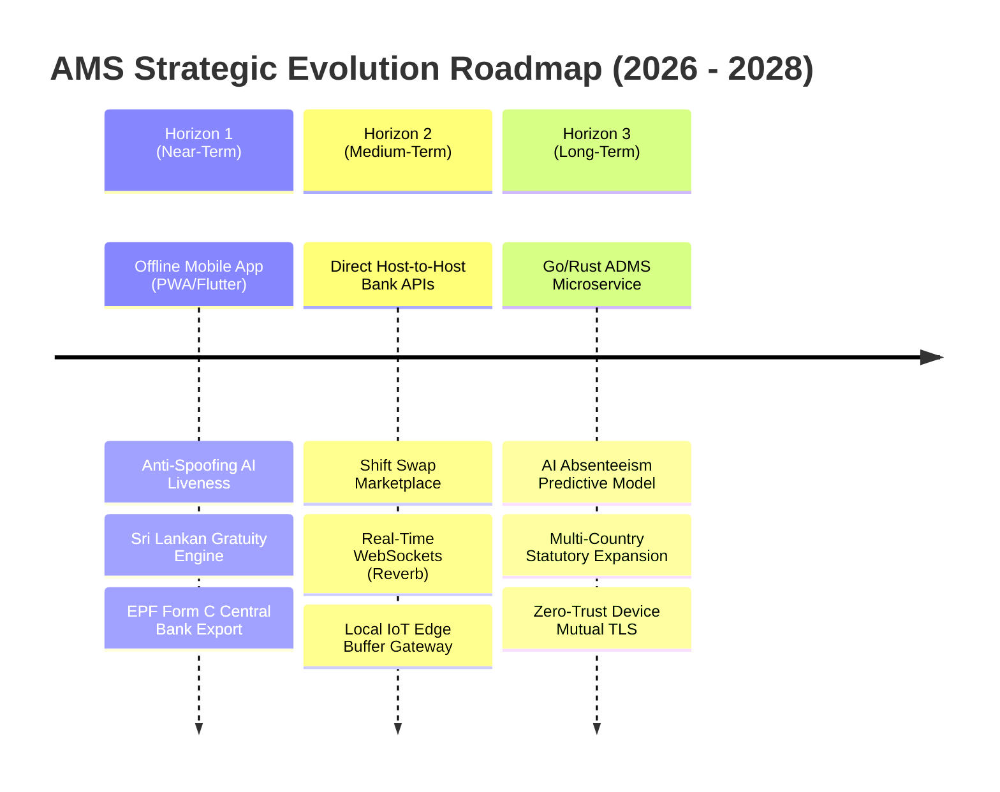
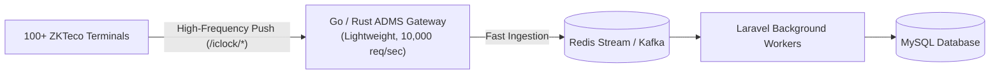

# Attendance & Workforce Management System (AMS)
## Document 08: Future Development Roadmap & Technical Vision

| Document Metadata | Details |
| :--- | :--- |
| **System Name** | Attendance Management System (AMS) - Biometric, Workforce & Payroll Platform |
| **Current Baseline** | V2.4 (Enterprise Edition) |
| **Target Horizon** | V3.0 – V3.5 Enterprise Evolution (2026 – 2028) |
| **Document Purpose** | Strategic Product Roadmap, Technical Debt Reduction & Architectural Evolution |
| **Audience** | Product Owners, Executive Leadership, Software Architects, Lead Developers |
| **Classification** | Strategic Planning / Technical Roadmap |

---

## 1. Executive Roadmap Overview

While AMS V2.4 provides a robust foundation for biometric timekeeping, advanced shifts, and Sri Lankan statutory payroll, modern enterprise demands require ongoing evolution. 

This roadmap outlines the recommended technical initiatives categorized across three strategic horizons:

---

## 2. Horizon 1: Near-Term Enhancements (Q1 – Q2)

### 2.1 Native / PWA Mobile App with Offline Punching
* **Current Limitation**: Staff currently access web punch via mobile browser (`/portal/punch`), which requires active internet and manual page navigation.
* **Proposed Enhancement**:
  * Build a lightweight cross-platform mobile application (Flutter or Progressive Web App).
  * **Offline Punch Storage**: Enable staff to clock in/out in low-connectivity areas (e.g. factory basements, remote construction sites, client premises). Punches are encrypted locally with device biometric authentication (Fingerprint / FaceID) and automatically synced once an internet connection is established.
  * **Mock GPS Detection**: Detect and block fake GPS location spoofing apps on Android and iOS.

### 2.2 AI-Powered Selfie Liveness Detection
* **Current Limitation**: Web punch validates geolocation, but a user could potentially upload a pre-captured photo of another person if remote photo capture is enabled.
* **Proposed Enhancement**:
  * Integrate an on-device JavaScript or lightweight cloud computer vision model (e.g., MediaPipe or OpenCV) to perform **passive/active liveness detection** (prompting the user to blink, smile, or turn slightly).
  * Auto-match the punch selfie against the employee's verified onboarding profile photo using facial embeddings.

### 2.3 Sri Lankan Gratuity Act Calculation Engine
* **Current Limitation**: While monthly EPF and ETF are automated, final employee separation gratuity payments are calculated manually.
* **Proposed Enhancement**:
  * Implement automated Gratuity computation adhering strictly to the **Payment of Gratuity Act No. 12 of 1983**:
    $$\text{Gratuity Amount} = \frac{\text{Last Drawn Basic Salary}}{2} \times \text{Completed Years of Continuous Service}$$
  * Automatically evaluate service thresholds (minimum 5 continuous years of service) and generate formal gratuity discharge settlement vouchers upon employee termination or resignation.

### 2.4 Automated Central Bank EPF Form C & ETF Form 6 Digital Exports
* **Current Limitation**: Payroll officers currently compile EPF/ETF monthly remittance returns manually or through generic spreadsheets.
* **Proposed Enhancement**:
  * Generate the official, machine-readable **EPF Form C Electronic Text File** and **ETF Form 6 Remittance Diskette File** format prescribed by the Central Bank of Sri Lanka (CBSL) and Employees' Trust Fund Board.

---

## 3. Horizon 2: Medium-Term Enhancements (Q3 – Q4)

### 3.1 Direct Host-to-Host (H2H) Commercial Banking Integration
* **Current Limitation**: Payroll files are exported as CSV/SLIPS format and manually uploaded into banking portals.
* **Proposed Enhancement**:
  * Integrate secure direct Host-to-Host (H2H) SFTP / REST API channels with major Sri Lankan commercial banks (Commercial Bank of Ceylon, Sampath Bank, Hatton National Bank, Bank of Ceylon).
  * Enable authorized finance directors to disburse company-wide salaries with two-factor token authentication directly from the AMS console.

### 3.2 Shift Swap & Voluntary Roster Marketplace
* **Current Limitation**: Shift changes must be manually coordinated with branch managers through ad-hoc schedule overrides.
* **Proposed Enhancement**:
  * Introduce a **Shift Swap Marketplace** in the Self-Service Employee Portal.
  * Employees in the same designation and branch can propose a 1-to-1 shift exchange.
  * The system validates maximum consecutive work hours, checks skill parity, and routes the proposal to the supervisor for one-click approval.

### 3.3 Real-Time WebSockets via Laravel Reverb
* **Current Limitation**: The admin console relies on periodic page refreshes or standard polling to view newly clocked punches and terminal statuses.
* **Proposed Enhancement**:
  * Implement **Laravel Reverb** (WebSocket server) for instant push updates.
  * Real-time entrance monitoring: As an employee scans at a turnstile or terminal, their photo, name, and timestamp appear immediately on the security guard / reception dashboard without page reloads.

### 3.4 Local IoT Edge Buffer Gateway (Branch Network Resilience)
* **Current Limitation**: If a remote branch loses internet connectivity, ZKTeco terminals buffer records in local flash memory, but cannot receive commands or communicate with local networks until cloud connectivity is restored.
* **Proposed Enhancement**:
  * Deploy a lightweight micro-gateway (Docker container running on a Raspberry Pi or branch server) that acts as a local proxy.
  * Terminals communicate with the local gateway, which guarantees local door-access logic and buffers thousands of scans, syncing with the cloud AMS platform via compressed batches when the WAN link recovers.

---

## 4. Horizon 3: Long-Term Enterprise Architecture (V3.0)

### 4.1 High-Concurrency ADMS Push Microservice (Go / Rust)
* **Current Architecture**: The `/iclock/*` endpoints are handled directly by Laravel 12 PHP-FPM workers.
* **Scaling Bottleneck**: When expanding to **100+ physical terminals** polling `/iclock/getrequest` every 30 seconds alongside thousands of simultaneous morning scans, PHP-FPM processes can become saturated.
* **Proposed Architecture**:
  * Decouple the ADMS endpoint into a high-concurrency, low-footprint microservice written in **Go** or **Rust**.
  * The microservice handles thousands of concurrent persistent HTTP connections, pushes raw punch payloads into a **Redis Stream** or **Apache Kafka** topic, and returns `OK` in $< 5\text{ ms}$.
  * The Laravel core consumes the stream asynchronously via background workers.

### 4.2 AI-Powered Predictive HR & Absenteeism Analytics
* **Proposed Enhancement**:
  * Train machine learning models on historical attendance data to identify:
    * **Burnout & Turnover Risk**: Correlation between high overtime hours, erratic shift changes, and resignation patterns.
    * **Absenteeism Forecasting**: Predictive staffing shortfalls around national holidays or shift transitions, allowing managers to proactively adjust rosters.
    * **Anomaly & Buddy-Punching Detection**: Pattern recognition flagging unusual punch velocities (e.g., multiple employees clocking in within 2 seconds of each other at the same terminal).

### 4.3 Mutual TLS (mTLS) & Zero-Trust Hardware Security
* **Proposed Enhancement**:
  * Implement Mutual TLS (mTLS) for hardware devices supporting client certificates, ensuring hardware cannot connect to the server without a cryptographically signed hardware certificate.
  * Add automatic network quarantine for any terminal exhibiting suspicious payload modifications or tampering alerts.

### 4.4 Multi-Country Statutory Payroll Expansion
* **Proposed Enhancement**:
  * Abstract the payroll engine into a plugin-based calculation module supporting multi-country jurisdictions for regional corporate expansion:
    * **United Arab Emirates (UAE)**: Wages Protection System (WPS) file generation, end-of-service gratuity calculation.
    * **United Kingdom**: PAYE and National Insurance (NI) deductions.
    * **Maldives**: Maldives Retirement Pension Scheme (MRPS 7%/7%).

---

## 5. Summary Priority Matrix

| Initiative | Business Impact | Technical Complexity | Recommended Quarter |
| :--- | :--- | :--- | :--- |
| **Native/PWA Mobile Punch with Offline Sync** | ⭐⭐⭐⭐⭐ (Very High) | Medium | **Q1 2027** |
| **AI Selfie Liveness & Anti-Spoofing** | ⭐⭐⭐⭐ (High) | Medium | **Q1 2027** |
| **Sri Lankan Gratuity Act Engine** | ⭐⭐⭐⭐ (High) | Low | **Q2 2027** |
| **Central Bank EPF Form C Digital Export** | ⭐⭐⭐⭐⭐ (Very High) | Low | **Q2 2027** |
| **Real-Time WebSockets (Laravel Reverb)** | ⭐⭐⭐⭐ (High) | Medium | **Q3 2027** |
| **Host-to-Host Commercial Bank Direct APIs** | ⭐⭐⭐⭐⭐ (Very High) | High | **Q3 2027** |
| **Branch IoT Edge Buffer Gateway** | ⭐⭐⭐⭐ (High) | High | **Q4 2027** |
| **Go/Rust High-Concurrency Ingestion Gateway** | ⭐⭐⭐⭐⭐ (Very High) | High | **V3.0 (2028)** |
| **AI Predictive Workforce Analytics** | ⭐⭐⭐ (Medium) | Very High | **V3.0 (2028)** |
