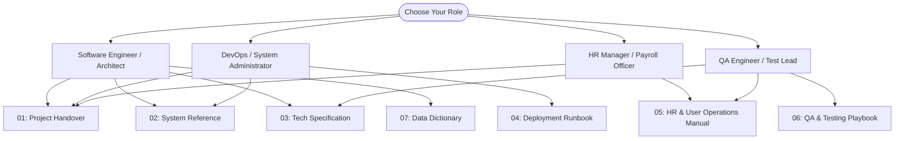

# AMS Enterprise Documentation Hub
### Central Index & Persona-Based Navigation Guide

Welcome to the **Attendance Management System (AMS) Documentation Hub**. This directory provides technical, operational, and business documentation for the AMS V2.4 Enterprise Platform.

---

## 🗺️ Role-Based Reading Pathways

Select your role below for a tailored reading path through the documentation:

---

## 📚 Complete Document Catalog

### 📑 [01. Project Handover Document](file:///c:/xampp/htdocs/laravel-project-Bio-metrics/docs/01_PROJECT_HANDOVER_DOCUMENT.md)
* **Target Audience**: Engineering Leadership, Project Managers, Incoming Core Developers.
* **Core Topics**: Executive summary, stakeholder contact directory, functional module checklist, codebase layout, third-party libraries, development branching strategy, and operational handover sign-off checklist.

### 🏛️ [02. System Reference Document (SRD)](file:///c:/xampp/htdocs/laravel-project-Bio-metrics/docs/02_SYSTEM_REFERENCE_DOCUMENT.md)
* **Target Audience**: Software Architects, Senior Backend Engineers, Database Administrators.
* **Core Topics**: System topology diagrams, complete database ERDs across 5 functional domains, API endpoints specification (`/iclock/*` and `/adms/*`), granular RBAC matrix, and background scheduler timetable.

### ⚙️ [03. Technical Specification Document (Tech Spec)](file:///c:/xampp/htdocs/laravel-project-Bio-metrics/docs/03_TECHNICAL_SPECIFICATION_DOCUMENT.md)
* **Target Audience**: Core Developers, Algorithm Specialists, Compliance Auditors.
* **Core Topics**: ZKTeco push protocol wire formats, command queue lifecycle, shift resolution hierarchy, dynamic punch windowing, Sri Lankan statutory payroll formulas (EPF 8%/12%, ETF 3%, APIT progressive tax brackets), and database query benchmarks.

### 🚀 [04. Runbook / Deployment Guide](file:///c:/xampp/htdocs/laravel-project-Bio-metrics/docs/04_DEPLOYMENT_RUNBOOK.md)
* **Target Audience**: DevOps Engineers, Cloud Administrators, Field Support Technicians.
* **Core Topics**: Production server sizing, cPanel shared hosting setup, Ubuntu 22.04 LTS VPS setup with Nginx/PHP-FPM, ZKTeco SenseFace M2F-LR terminal on-screen configuration, backup/restore runbooks, and incident troubleshooting.

### 📖 [05. HR & User Operations Manual](file:///c:/xampp/htdocs/laravel-project-Bio-metrics/docs/05_USER_MANUAL_AND_HR_OPERATIONS_GUIDE.md)
* **Target Audience**: HR Managers, Payroll Officers, Branch Managers, General Employees.
* **Core Topics**: Step-by-step UI walkthroughs for employee onboarding, digital asset handover, shift rostering, approving attendance exceptions (late, early, overtime), running monthly payroll batches, generating payslip PDFs, and Self-Service Portal usage.

### 🧪 [06. QA & Testing Playbook](file:///c:/xampp/htdocs/laravel-project-Bio-metrics/docs/06_QA_AND_UAT_TESTING_PLAYBOOK.md)
* **Target Audience**: Quality Assurance Engineers, Test Automation Leads, UAT Evaluators.
* **Core Topics**: 8-phase automated production validation command (`php artisan app:validate-production`), mock hardware terminal simulation (`php artisan app:simulate-adms-device`), test credentials, edge-case test matrices, and test sign-off templates.

### 🗄️ [07. Database Data Dictionary](file:///c:/xampp/htdocs/laravel-project-Bio-metrics/docs/07_DATABASE_DATA_DICTIONARY.md)
* **Target Audience**: Database Administrators, Backend Developers, Data Analysts.
* **Core Topics**: Exhaustive column-level schema documentation for all core tables: data types, nullability, default values, foreign key constraints, indexes, and business rules.

### 🔮 [08. Future Development Roadmap](file:///c:/xampp/htdocs/laravel-project-Bio-metrics/docs/08_FUTURE_DEVELOPMENT_ROADMAP.md)
* **Target Audience**: Product Owners, Software Architects, Executive Leadership, Lead Developers.
* **Core Topics**: Near-term, medium-term, and long-term enterprise evolution: Mobile PWA with offline punch caching, AI selfie liveness detection, Sri Lankan Gratuity Act calculation, direct commercial bank APIs, real-time WebSockets (Reverb), and Go/Rust high-concurrency ADMS microservices.

---

## 🔍 Document Version History

| Version | Date | Author | Description of Changes |
| :--- | :--- | :--- | :--- |
| **V1.0** | June 2026 | Engineering Team | Initial core architecture documentation and basic biometric logging. |
| **V2.0** | July 2026 | Architecture Team | Introduction of multi-company hierarchy, RBAC, and early shift engine. |
| **V2.2** | August 2026 | Systems Team | ZKTeco SenseFace M2F-LR full push protocol integration and UAT reports. |
| **V2.4** | September 2026 | Core Engineering & DevOps | Enterprise Edition release: Statutory Sri Lankan payroll (EPF/ETF/APIT), Digital Onboarding, Complete 8-part Documentation Suite. |
